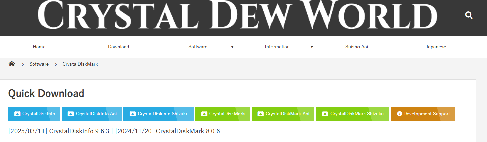
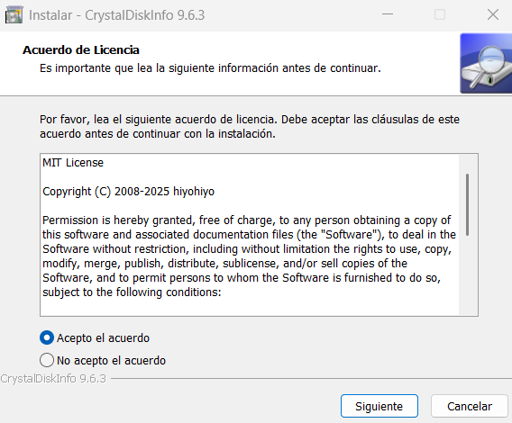
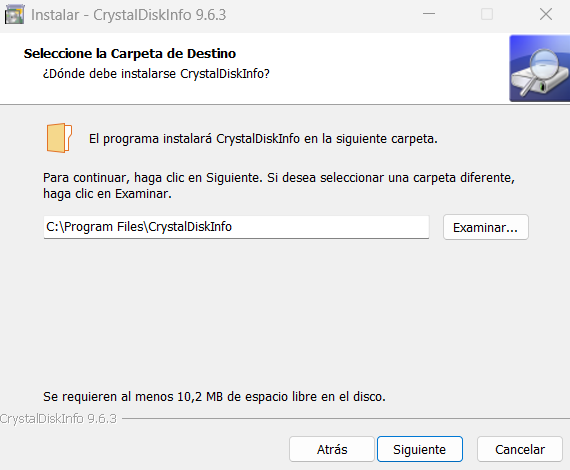
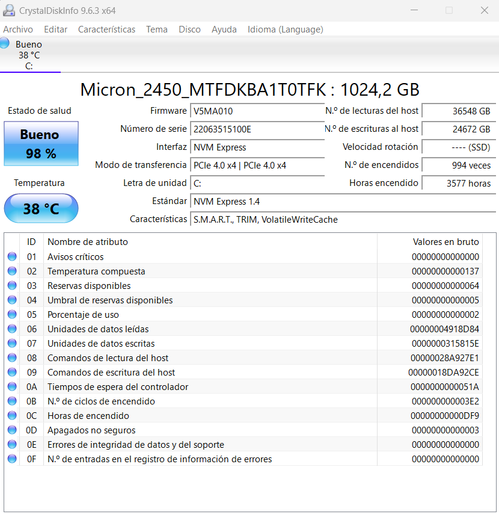

## Mini guía: CrystalDiskMark

### Introducción

CrystalDiskMark es una herramienta gratuita que mide el rendimiento de tus discos duros y unidades SSD. Es útil para verificar si tus unidades de almacenamiento están funcionando a su velocidad óptima.

### Descarga e Instalación

1. **Descarga:**
   
   * Vamos a la [página oficial de CrystalDiskMark](https://crystalmark.info/en/software/crystaldiskmark/).
     
     
   * Hacemos clic en CrystalDiskInfo, el primero de todos.
2. **Instalación:**
   
   * Ejecutamos el archivo descargado.
   * Seguimos las instrucciones del asistente de instalación.
   * Aceptamos el acuerdo de licencia y elegimos la ubicación de instalación.
     
     
     
   * Por ultimo hacemos clic en instalar para completar la instalación.

### Uso Básico

1. **Ejecución:**
   
   * Abrimos CrystalDiskMark desde el menú de inicio.
2. **Interfaz:**
   
   * Seleccionamos la unidad que deseamos probar.
   * Hacemos clic en "All" para ejecutar todas las pruebas.

     
     Yo solo tengo una unidad por ello no me salen mas para seleccionar.

     ## Conclusion:
   
   CrystalDiskMark es una herramienta simple pero poderosa para medir el rendimiento de las unidades de almacenamiento. Sus pruebas secuenciales y aleatorias permiten evaluar la velocidad de lectura y escritura de discos duros y unidades SSD, lo que es útil para verificar si las unidades están funcionando a su velocidad óptima y para comparar el rendimiento de diferentes unidades.

