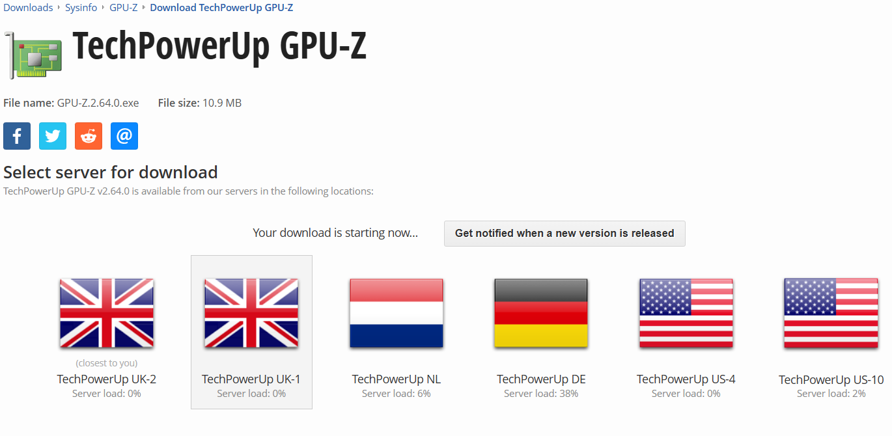
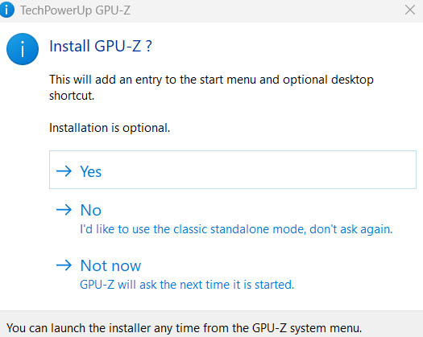
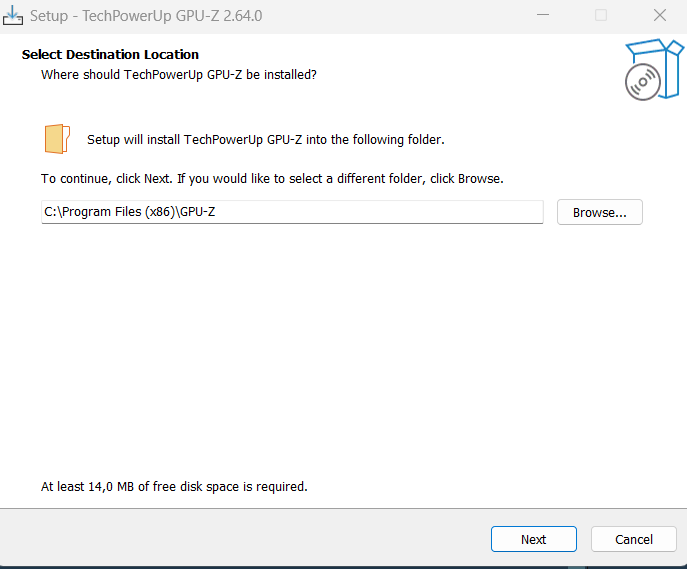
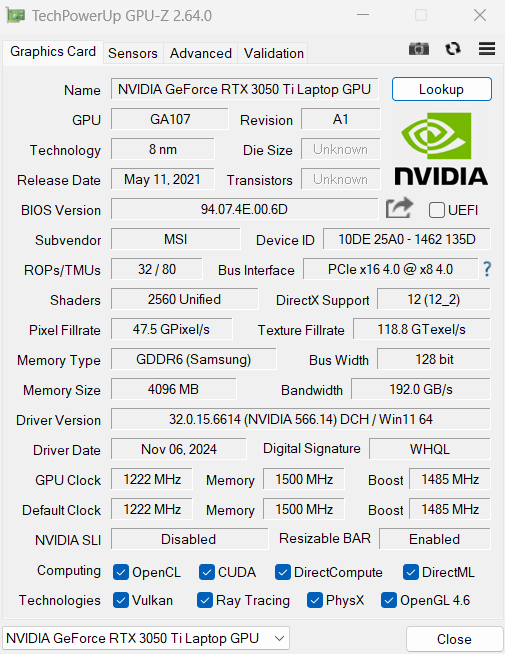
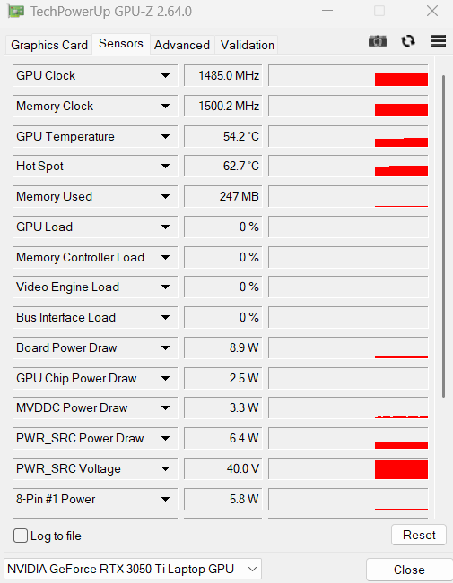
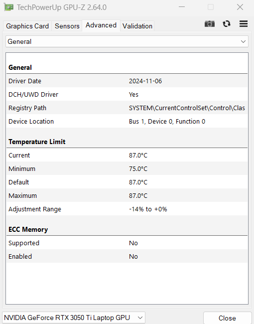

## Mini guía: GPU-Z

### Introducción

GPU-Z es una herramienta gratuita que proporciona información detallada sobre tu tarjeta gráfica (GPU). Es útil para conocer las especificaciones de tu GPU y monitorear sus temperaturas y frecuencias.

### Descarga e Instalación

1. **Descarga:**
   
   * Vamos a la [página oficial de GPU-Z](https://www.techpowerup.com/gpuz/).
   * Hacemos clic en "Download GPU-Z".
     
     
   * Eligimos el servidor mas cercano para una descarga lo mas rapida posible.
     
     
2. **Instalación:**
   
   * Ejecutamos el archivo descargado.
     
     
     
     Aqui marcamos Yes.
   * Seguimos las instrucciones del asistente de instalación.
   * Aceptamos el acuerdo de licencia y elegimos la ubicación de  instalación.
     
     
   * Y por último hacemos clic en "Install" para completar la instalación.

### Uso Básico

1. **Ejecución:**
   
   * Abrimos GPU-Z desde el menú de inicio.
   
2. **Interfaz:**
   
   * La interfaz principal muestra información sobre tu GPU, incluyendo modelo, fabricante, memoria y sensores.
     
     

   * La pestaña "Sensors" muestra las temperaturas y frecuencias de la GPU en tiempo real.
     
     

   * La pestaña "Advanced" nos ofrece información técnica detallada sobre la tarjeta gráfica, incluyendo detalles del controlador, rutas de registro, límites de temperatura, soporte de memoria ECC y otras especificaciones avanzadas, destinada principalmente a usuarios con conocimientos técnicos profundos que necesitan diagnósticos y soluciones de problemas detallados.

     

