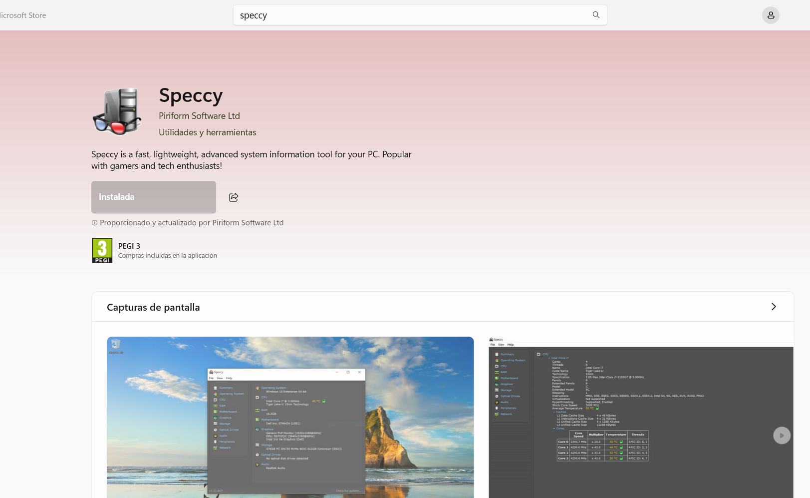
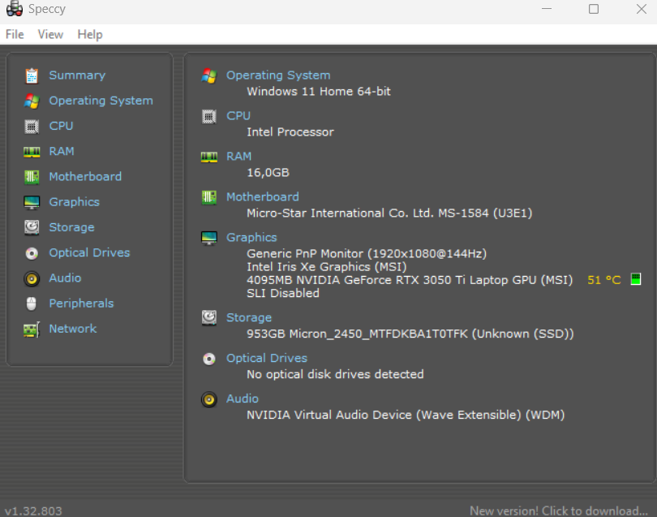

## Mini guía: Speccy

### Introducción

Speccy es una herramienta gratuita que proporciona información general sobre tu hardware y sistema operativo. Es útil para obtener una visión rápida de las especificaciones de tu PC.

### Descarga e Instalación

1. **Descarga** e **Instalacion**
   
   * En esta ocasion Speccy se encuentra en la microsoft store, por lo que sera tan sencillo como ir y darle a descargar, se descargara e instalara automaticamente.
     
     
     
     ### Uso Básico
2. **Ejecución:**
   
   * Abrimos Speccy desde el menú de inicio.
3. **Interfaz:**
   
   * La interfaz principal muestra un resumen de tu sistema.
   * Podemos navegar por las distintas secciones para obtener información detallada sobre cada componente de nuestro sistema.
     
     
     
     ## Conclusion:
   
   Speccy es una herramienta útil para obtener una visión general rápida de las especificaciones de hardware y software de un PC. Su interfaz clara y organizada facilita la navegación y la búsqueda de información específica. Speccy es una herramienta valiosa para diagnosticar problemas de hardware, verificar la compatibilidad de componentes y obtener información general sobre el sistema.

