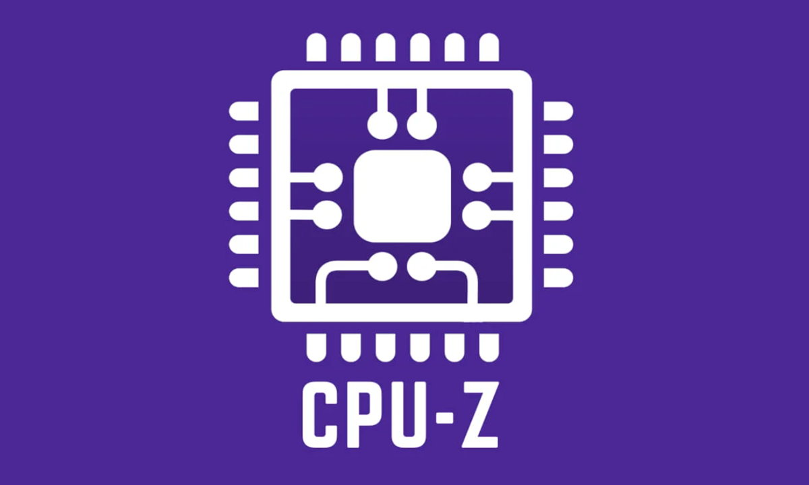

# CPU-Z

### Introducción

CPU-Z es una herramienta gratuita que proporciona información detallada sobre tu CPU, memoria RAM y placa base. Es útil para verificar las especificaciones de tu hardware y asegurarte de que todo esté configurado correctamente.

### Descarga e Instalación

1. **Descarga:**
   
   · Vamos a la pagina principal: [Link de descarga](https://www.cpuid.com/downloads/cpu-z/cpu-z_2.15-en.exe)
   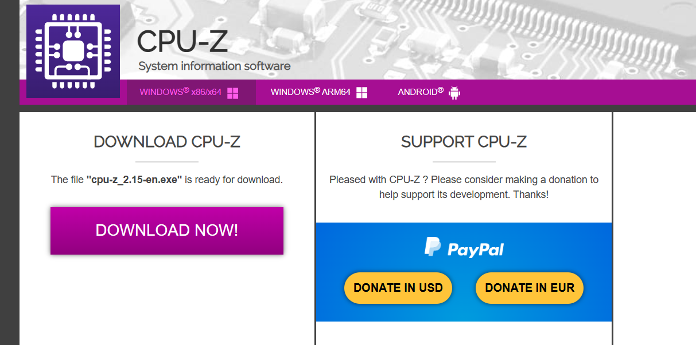
   · Hacemos click en dowload now!
   
   **Instalación:**
   
   · Ejecuta el archivo descargado.
   
   · Procedemos con la instalacion:
   
   1. 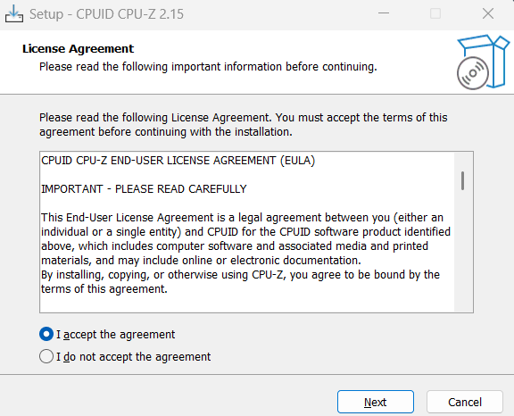
      
      Aceptamos y siguiente.
   2. 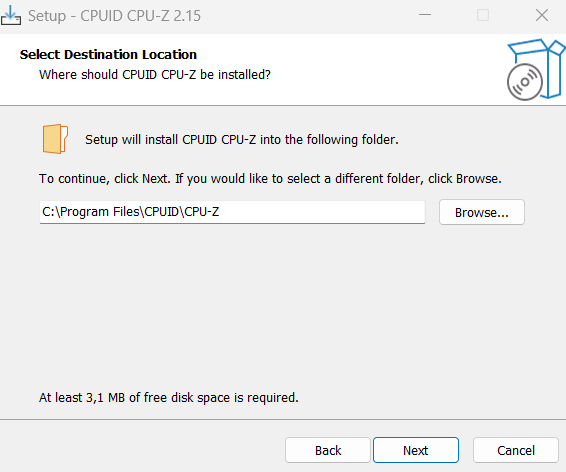
      
      Elegimos la carpeta donde se va a almacenar el programa
   3. 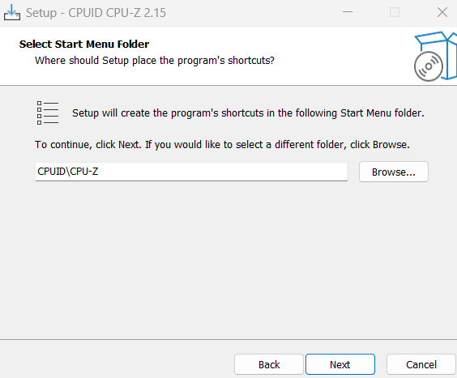
      
      Siguiente.
   4. 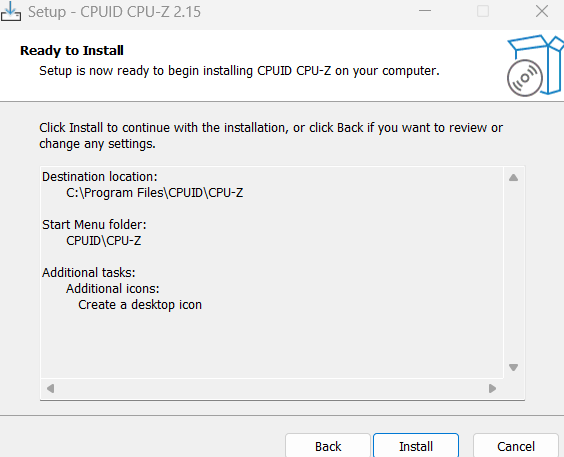
      
      Por último instalamos

### Uso Básico

2. **Ejecución:**
   
   · Abrimos CPU-Z desde el menú de inicio.
3. **Interfaz:**
   
   · La interfaz principal muestra información sobre tu CPU, incluyendo modelo, fabricante, velocidad y caché.
   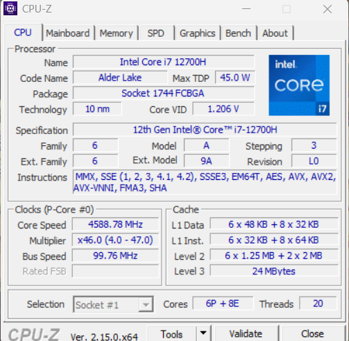
   
   · Puedes navegar por las pestañas "Mainboard", "Memory" y "SPD" para obtener información sobre la placa base y la memoria RAM.
   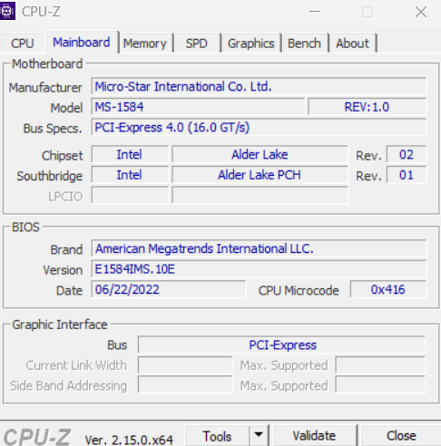
   
   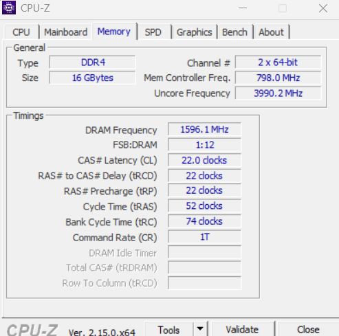
   
   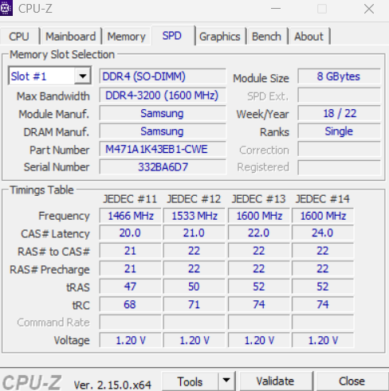
   
   · En la pestaña graphics puedes ver informacion sobre tu tarjeta grafica.
   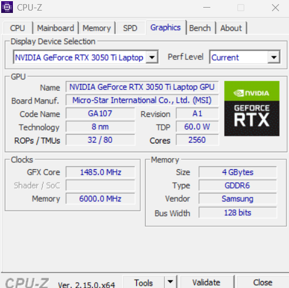
   
   · La pestaña "Bench" nos sirve para evaluar el rendimiento del procesador, permitiendo pruebas de un solo núcleo y multi núcleo, comparaciones con referencias y pruebas de estrés para verificar la estabilidad de la CPU.
   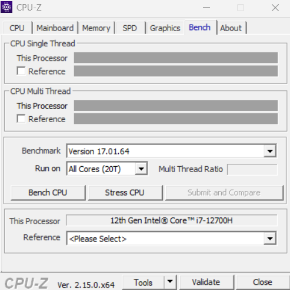
   
   ## Conclusion:
   
   CPU-Z es una herramienta esencial para cualquier persona que quiera conocer a fondo las especificaciones de su CPU, memoria RAM y placa base. Su interfaz intuitiva y la gran cantidad de información que proporciona la convierten en una herramienta imprescindible para diagnosticar problemas de hardware, verificar la compatibilidad de componentes y realizar overclocking de forma segura.

